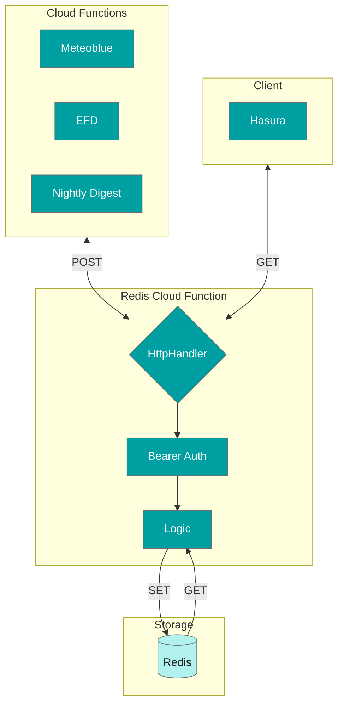

# redis-client-function

The `redis-client` function stores and serves up data from Redis.

Typically, this function is called via scheduled `POST` requests from cloud functions such as the `weather-client-function`, `nightly-digest-function`, or the `efd-client-function` to cache data into redis and `GET` requests to obtain those cached results from redis to Hasura.


## API description
All endpoints require a `Bearer` auth token.

Here's a high level summary of our endpoints:
- `GET`
    - `/` - returns general summit data information that we've collected. This is more of a historical artifact as we may not need this anymore, but we kept it as the information could be useful if needed in the future.
    - `/widgets` - the exact information that the front-end nextjs client needs. Nothing more and nothing less, formatted exactly the way they want it. The response should look something like:
        ```json
        {
            "weather": {
                "pictocode": 2
            },
            "exposure": {
                "count": 7
            },
            "dome": {
                "isOpen": true
            },
            "survey": {
                "progress": "0.4"
            },
            "alert": {
                "count": 0
            }
        }
        ```
    - `/full` - shows a bit more information that the `/widgets` endpoint such as `date-last-run` for developer debugging.
- `POST` - cache endpoints for various types of data
    - '/current-stats'
    - '/hourly-stats'
    - '/daily-stats'
    - '/dome-stats'
    - '/raw-current-weather-stats'
    - '/basic-weather-stats'
    - '/cloud-weather-stats'
    - '/nightly-digest-stats'
        - This one in particular is a bit more complicated. We want exposure count calls to happen at most once per day. For the happy path, we track 2 keys:
            - `date-last-run` which is the date we last run a nightly digest call
            - `exposures` which is the running exposure count
        There's an optional `reaccumulate` mode that overrides the `lastRunDate` check to allow us to repopulate the exposure counts in the rare case we have somehow accumulated an incorrect count. We end up using this `exposures` count to calculate the survey progress to 1 decimal place, which the consuming front-end client will read as an integer (no decimal places) as this is just a back of the envelope calculation.
- `DELETE` - allows users to clear redis cache given key via something like `/?key={key}`. This is mostly useful for developers in case they need to quickly fix something without having to go into redis manually.

## Architecture

### Container diagram
The EPO team takes ownership of everything shown here. However, the cloud functions rely on APIs external to the EPO team (not shown in this diagram). 

Note: We will also add an external source for alerts in the near future, likely from a Prometheus data source.

At a very high level:

## Development
### Environment Variables
Make sure you have populated your `.env` file based on `.env.sample`

- `REDIS_BEARER_TOKEN` is the required auth header
- `TOTAL_EXPECTED_EXPOSURES` is the total expected lifetime exposures for the survey

### Deployment
Build the typescript:

```
yarn build
```

The above command will create a `/dist` folder with the built Javascript.

Then, ensure your `gcloud` CLI is pointed at the correct GCP project and deploy the cloud function:

```
sh deploy.sh
```


### Testing
To run our unit tests:
```
yarn test
```